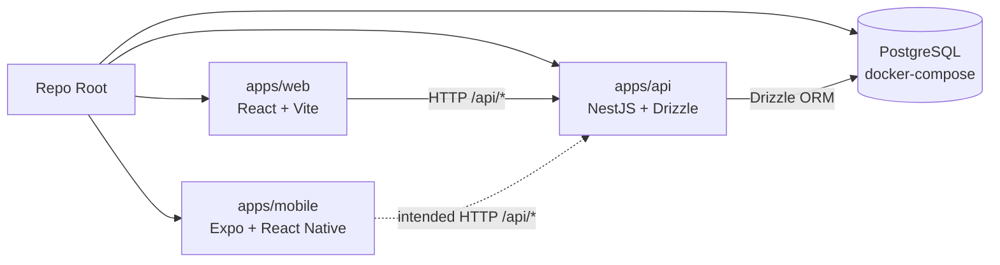
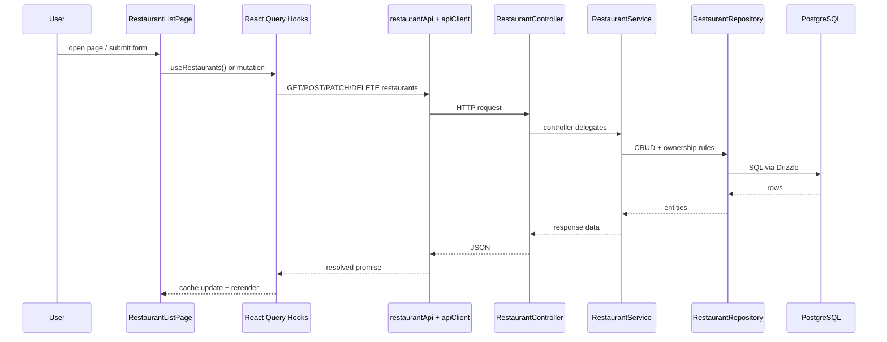
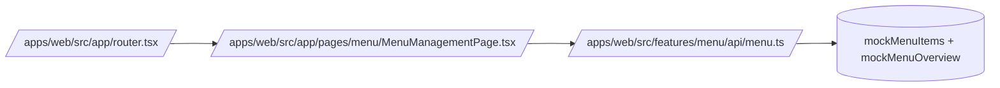

# Monorepo Codebase Guide

## Scope Of This Pass

This guide is based only on the files inspected in this session. It avoids guessing beyond the current visible code.

Inspected areas:

- Root workspace files: `/package.json`, `/pnpm-workspace.yaml`, `/turbo.json`, `/docker-compose.yml`, `/RESTAURANT.md`
- Backend runtime and docs: `/apps/api/src/main.ts`, `/apps/api/src/app.module.ts`, `/apps/api/src/drizzle/*`, `/apps/api/src/lib/auth.ts`, `/apps/api/src/module/auth/auth.schema.ts`, `/apps/api/src/module/restaurant-catalog/**`, `/apps/api/docs/bounded-context.md`
- Web runtime: `/apps/web/src/main.tsx`, `/apps/web/src/app/*`, `/apps/web/src/components/layout/*`, `/apps/web/src/lib/api-client.ts`, `/apps/web/src/app/pages/auth/*`, `/apps/web/src/app/pages/menu/*`, `/apps/web/src/features/menu/api/menu.ts`, `/apps/web/src/features/restaurant/**`, `/apps/web/docs/project-structure.md`
- Mobile runtime and docs: `/apps/mobile/src/app/_layout.tsx`, `/apps/mobile/doc/project-structure.md`

---

## 1. Monorepo Structure

### Workspace shape

- Frontend apps:
  - `/apps/web` = React 19 + Vite browser app
  - `/apps/mobile` = Expo / React Native app shell
- Backend services:
  - `/apps/api` = NestJS API, currently a modular monolith
- Shared packages/libs:
  - `/pnpm-workspace.yaml` declares `/packages/*`
  - No `/packages` directory is present in the current workspace snapshot
  - Result: shared code is currently app-local, not extracted into workspace packages yet

### Responsibilities

- `/apps/api`
  - Owns HTTP API, auth integration, business logic, and database access
  - Current visible bounded context: restaurant catalog
- `/apps/web`
  - Owns the management portal UI
  - Current visible features: auth pages, menu management UI, restaurant feature slice
- `/apps/mobile`
  - Owns the mobile client shell
  - Current visible code only shows the app-wide React Query and focus/online wiring

### Communication model

- Web to API:
  - Axios client in `/apps/web/src/lib/api-client.ts`
  - Bearer token read from `localStorage.auth_token`
  - Intended REST communication to Nest controllers
- API to DB:
  - Drizzle ORM over PostgreSQL
  - Local database is started by `/docker-compose.yml`
- Auth:
  - Better Auth is configured inside the API and exposed through the Nest app
  - OpenAPI docs for app routes and auth routes are merged in `/apps/api/src/main.ts`

### Monorepo Diagram



---

## 2. Current Feature Map

### Feature areas visible in code

- Auth
  - Backend: Better Auth setup plus auth schema tables
  - Web: login and register pages exist
  - Mobile: no visible auth routes yet in current snapshot
- Restaurant Catalog
  - Backend: real `RestaurantModule` and `MenuModule` with controllers, services, repositories, and Drizzle schemas
  - Web restaurant slice: real API integration exists through React Query hooks
  - Web menu slice: UI exists, but current data source is still mocked

### Important distinction: planned architecture vs live code

- `/apps/api/docs/bounded-context.md` describes a broader target architecture: IAM, ordering, delivery, payment, notifications, analytics
- The currently inspected runtime code does not show those contexts implemented yet
- The visible backend code today is much narrower: auth plus restaurant catalog

---

## 3. Focused File Map

### Root Files

- `/package.json`: Root task entrypoint. Used by developers and CI to run `turbo` commands. Depends on child app scripts.
- `/pnpm-workspace.yaml`: Declares workspace package locations. Used by pnpm. Depends on `/apps/*` and the planned `/packages/*` convention.
- `/turbo.json`: Defines shared build, test, lint, and dev pipelines. Used by root scripts. Depends on each app exposing matching script names.
- `/docker-compose.yml`: Starts PostgreSQL for local development. Used by local environment, not imported by app code. Depends on `POSTGRES_*` env vars.
- `/RESTAURANT.md`: Backend design note for the restaurant module. Not runtime code. Depends on the restaurant module contract remaining aligned.

### Backend Files

- `/apps/api/src/main.ts`: Nest bootstrap. Called by `nest start` or `pnpm --filter api dev`. Depends on `/apps/api/src/app.module.ts` and `/apps/api/src/lib/auth.ts`. Sets global prefix to `/api`, global validation, Swagger JSON at `/api-spec.json`, and docs UI at `/docs`.
- `/apps/api/src/app.module.ts`: Root Nest module. Imported by `main.ts`. Depends on `ConfigModule`, `DatabaseModule`, `RestaurantCatalogModule`, and Better Auth Nest integration.
- `/apps/api/src/drizzle/db.ts`: Creates a shared Drizzle connection for Better Auth. Used by `/apps/api/src/lib/auth.ts`. Depends on `DATABASE_URL`.
- `/apps/api/src/drizzle/drizzle.module.ts`: Provides the Nest DI database connection token. Imported by feature modules. Depends on `DATABASE_URL` and Drizzle's Node Postgres adapter.
- `/apps/api/src/drizzle/schema.ts`: Central schema barrel. Used by Better Auth and repository typing. Depends on auth, restaurant, and menu schema files.
- `/apps/api/src/lib/auth.ts`: Better Auth configuration. Used by both `main.ts` and `app.module.ts`. Depends on `/apps/api/src/drizzle/db.ts` and `/apps/api/src/drizzle/schema.ts`.
- `/apps/api/src/module/auth/auth.schema.ts`: Auth persistence tables for Better Auth. Used through `/apps/api/src/drizzle/schema.ts`. Depends on Drizzle PG schema primitives.
- `/apps/api/src/module/restaurant-catalog/restaurant-catalog.module.ts`: Aggregates `MenuModule` and `RestaurantModule`. Imported by `AppModule`. Depends on the two submodules.
- `/apps/api/src/module/restaurant-catalog/restaurant/restaurant.module.ts`: Restaurant feature boundary. Imported by `RestaurantCatalogModule` and `MenuModule`. Depends on `DatabaseModule`, controller, service, and repository.
- `/apps/api/src/module/restaurant-catalog/restaurant/restaurant.controller.ts`: HTTP layer for `/api/restaurants`. Called by incoming authenticated requests. Depends on `RestaurantService`, auth guards, role decorators, and DTOs.
- `/apps/api/src/module/restaurant-catalog/restaurant/restaurant.service.ts`: Business rules for restaurant CRUD and gating. Called by the restaurant controller and by `MenuService`. Depends on `RestaurantRepository`.
- `/apps/api/src/module/restaurant-catalog/restaurant/restaurant.repository.ts`: Drizzle data access for restaurants. Called by `RestaurantService`. Depends on the DI database connection and `restaurant.schema.ts`.
- `/apps/api/src/module/restaurant-catalog/restaurant/restaurant.schema.ts`: Drizzle table definition for `restaurants`. Used by repository code and the central schema barrel.
- `/apps/api/src/module/restaurant-catalog/menu/menu.module.ts`: Menu feature boundary. Imported by `RestaurantCatalogModule`. Depends on `DatabaseModule` and `RestaurantModule` because menu ownership checks require restaurant lookup.
- `/apps/api/src/module/restaurant-catalog/menu/menu.controller.ts`: HTTP layer for `/api/menu-items`. Called by incoming authenticated requests. Depends on `MenuService`, auth guards, current-user decorator, and menu DTOs.
- `/apps/api/src/module/restaurant-catalog/menu/menu.service.ts`: Menu business rules. Called by the menu controller. Depends on `MenuRepository` and `RestaurantService` for existence and ownership validation.
- `/apps/api/src/module/restaurant-catalog/menu/menu.repository.ts`: Drizzle data access for `menu_items`. Called by `MenuService`. Depends on the DI database connection and `menu.schema.ts`.
- `/apps/api/src/module/restaurant-catalog/menu/menu.schema.ts`: Drizzle table and enums for menu items. Used by repository code and the central schema barrel. Depends on `restaurant.schema.ts` for the FK.
- `/apps/api/src/module/restaurant-catalog/menu/dto/menu.dto.ts`: HTTP contract and validation rules for menu endpoints. Used by `MenuController` and `MenuService`. Depends on class-validator and Swagger decorators.
- `/apps/api/docs/bounded-context.md`: Architecture target document. Not runtime. Useful to understand intended future module expansion.

### Web Files

- `/apps/web/src/main.tsx`: Browser entrypoint. Called by Vite. Depends on `/apps/web/src/app/app.tsx` and `/apps/web/src/index.css`.
- `/apps/web/src/app/app.tsx`: App composition root. Called by `main.tsx`. Depends on `/apps/web/src/app/provider.tsx` and `/apps/web/src/app/router.tsx`.
- `/apps/web/src/app/provider.tsx`: Global provider layer. Called by `App`. Depends on React Query.
- `/apps/web/src/app/router.tsx`: Route registration. Called by `App`. Depends on auth pages, menu pages, and `MainLayout`.
- `/apps/web/src/components/layout/MainLayout.tsx`: Shell for authenticated management routes. Called by the root route in the router. Depends on `AppSidebar`, breadcrumb components, and `Outlet`.
- `/apps/web/src/components/layout/AppSidebar.tsx`: Sidebar navigation. Called by `MainLayout`. Depends on React Router location and shared sidebar primitives.
- `/apps/web/src/lib/api-client.ts`: Shared Axios instance. Used by API feature clients. Depends on `VITE_API_BASE_URL` or the fallback `http://localhost:3000`, and reads `auth_token` from local storage.
- `/apps/web/src/app/pages/auth/login/LoginPage.tsx`: Login page composition. Called by router path `/auth/login`. Depends on auth feature UI components.
- `/apps/web/src/app/pages/auth/register/RegisterPage.tsx`: Registration page composition. Called by router path `/auth/register`. Depends on register feature UI components.
- `/apps/web/src/app/pages/menu/MenuManagementPage.tsx`: Current menu dashboard page. Called by router path `/menu`. Depends on menu feature components and currently imports mocked menu data.
- `/apps/web/src/app/pages/menu/CreateMenuItemPage.tsx`: Create-item page shell. Called by router path `/menu/create`. Depends on menu create-form components. Current save/publish handlers only log to console.
- `/apps/web/src/features/menu/api/menu.ts`: Mock menu data source. Called by `MenuManagementPage`. Depends only on in-file mock objects and fake async delays.
- `/apps/web/src/features/restaurant/api/restaurant.api.ts`: Real restaurant HTTP client. Used by restaurant hooks. Depends on `apiClient` and restaurant types.
- `/apps/web/src/features/restaurant/hooks/useRestaurants.ts`: Read-side React Query hooks for restaurants. Used by restaurant pages and components. Depends on `restaurantApi`.
- `/apps/web/src/features/restaurant/hooks/useRestaurantMutations.ts`: Write-side React Query hooks for restaurants. Used by restaurant pages and components. Depends on `restaurantApi` and query invalidation keys.
- `/apps/web/src/features/restaurant/api/restaurant.types.ts`: TS shape for restaurant responses. Used by the restaurant API and components.
- `/apps/web/src/features/restaurant/schemas/restaurant.schema.ts`: Zod form schemas for create/update restaurant forms. Used by restaurant form workflows.
- `/apps/web/src/features/restaurant/index.ts`: Public barrel for the restaurant feature. Used by `/apps/web/src/pages/restaurant/RestaurantListPage.tsx`.
- `/apps/web/src/pages/restaurant/RestaurantListPage.tsx`: End-to-end restaurant CRUD page. Called nowhere in the current router. Depends on the restaurant feature barrel and UI button component.
- `/apps/web/docs/project-structure.md`: Frontend architecture guideline. Not runtime. Useful to understand intended page/feature boundaries.

### Mobile Files

- `/apps/mobile/src/app/_layout.tsx`: Expo Router root layout. Called by Expo Router. Depends on React Query, app focus state, and online/offline state wiring.
- `/apps/mobile/doc/project-structure.md`: Mobile architecture guideline. Not runtime. Useful for future route and feature organization.

---

## 4. Cross-Layer Request Flow

### Flow A: Restaurant CRUD is the clearest real FE -> BE path

This is the most complete end-to-end slice in the current code.



Mapped files:

- FE page: `/apps/web/src/pages/restaurant/RestaurantListPage.tsx`
- FE hooks: `/apps/web/src/features/restaurant/hooks/useRestaurants.ts`
- FE mutations: `/apps/web/src/features/restaurant/hooks/useRestaurantMutations.ts`
- FE HTTP client: `/apps/web/src/features/restaurant/api/restaurant.api.ts`
- Shared Axios: `/apps/web/src/lib/api-client.ts`
- BE controller: `/apps/api/src/module/restaurant-catalog/restaurant/restaurant.controller.ts`
- BE service: `/apps/api/src/module/restaurant-catalog/restaurant/restaurant.service.ts`
- BE repository: `/apps/api/src/module/restaurant-catalog/restaurant/restaurant.repository.ts`
- DB schema: `/apps/api/src/module/restaurant-catalog/restaurant/restaurant.schema.ts`

### Flow B: Current menu management page is still local/mock driven



What this means:

- The backend already has real menu endpoints in `/apps/api/src/module/restaurant-catalog/menu/*`
- The current web page does not call them yet
- The create page is also not wired to the API yet

### Intended future menu flow

```mermaid
flowchart LR
    CreatePage[CreateMenuItemPage] --> MenuHooks[New menu query/mutation hooks]
    MenuHooks --> MenuApi[New menu API client]
    MenuApi --> NestMenu[/api/menu-items]
    NestMenu --> MenuService
    MenuService --> MenuRepository
    MenuRepository --> Postgres
```

---

## 5. Important Current-State Observations

- `/apps/api/src/main.ts` sets a global `/api` prefix
- `/apps/web/src/features/restaurant/api/restaurant.api.ts` calls `/restaurants`
- `/apps/web/src/lib/api-client.ts` defaults to `http://localhost:3000`
- Therefore the web app likely needs `VITE_API_BASE_URL=http://localhost:3000/api` or a proxy rewrite; otherwise the default fallback misses the backend prefix

- All visible restaurant and menu backend endpoints are protected by `JwtAuthGuard` and `RolesGuard`
- Any new FE integration for those endpoints must include a valid token in local storage or replace the current token strategy

- The restaurant feature is more integrated than it first appears
- There is already a real FE client and React Query hook layer, but the page using it is not registered in the current router/sidebar

- The menu feature is the opposite
- It is visible in navigation and routing, but the current page is still mock-based and not yet connected to the live API

- The mobile app is currently only a shell in the visible code
- The docs describe a richer feature structure than what is currently present in `/apps/mobile/src/app`

---

## 6. What To Open Next

If your next task is to understand auth requirements for any new API call, open these first:

1. `/apps/api/src/module/auth/guards/jwt-auth.guard.ts`
2. `/apps/api/src/module/auth/decorators/current-user.decorator.ts`
3. `/apps/api/src/module/auth/guards/roles.guard.ts`

If your next task is to wire the menu UI to the real backend, open these next:

1. `/apps/api/src/module/restaurant-catalog/menu/dto/menu.dto.ts`
2. `/apps/api/src/module/restaurant-catalog/menu/menu.controller.ts`
3. `/apps/web/src/app/pages/menu/CreateMenuItemPage.tsx`
4. `/apps/web/src/features/menu/components/create/*`
5. `/apps/web/src/lib/api-client.ts`

If your next task is to extend the existing restaurant CRUD flow, open these next:

1. `/apps/web/src/pages/restaurant/RestaurantListPage.tsx`
2. `/apps/web/src/features/restaurant/components/RestaurantForm.tsx`
3. `/apps/web/src/features/restaurant/hooks/useRestaurantMutations.ts`
4. `/apps/api/src/module/restaurant-catalog/restaurant/restaurant.service.ts`

---

## 7. Safe Implementation Guidance

### Rule of thumb for choosing layers

- Change only web if:
  - the work is purely visual
  - the data already exists in the frontend state layer
- Change web and API if:
  - you need new server data
  - you need validation, persistence, or authorization changes
- Change API only if:
  - the UI already sends the right shape and only backend rules/storage must change
- Change mobile too if:
  - the feature must ship cross-platform, because mobile currently has its own app shell and route system

### Likely first real feature: replace mocked menu data with live API

Recommended plan:

1. Confirm the runtime base URL strategy in `/apps/web/src/lib/api-client.ts` so requests actually reach `/api/*`.
2. Add a real menu API client in `/apps/web/src/features/menu/api/menu.api.ts`.
3. Add React Query hooks such as `/apps/web/src/features/menu/hooks/useMenuItems.ts` and `/apps/web/src/features/menu/hooks/useMenuMutations.ts`.
4. Replace `mockMenuItems` and `mockMenuOverview` usage inside `/apps/web/src/app/pages/menu/MenuManagementPage.tsx`.
5. Wire `/apps/web/src/app/pages/menu/CreateMenuItemPage.tsx` to `POST /api/menu-items`.
6. Reuse `/apps/api/src/module/restaurant-catalog/menu/dto/menu.dto.ts` as the contract source when shaping the frontend payload.
7. Verify auth, because menu endpoints require authenticated `admin` or `restaurant` roles for writes.

Backend impact for that specific feature:

- No backend change is required if the existing menu DTO already matches the form you want
- Backend changes are required only if you need new fields, new filters, or public unauthenticated menu access

---

## 8. Working Model To Keep In Mind

- The backend is already structured as a modular monolith, not a random Nest app
- The web app already has a clean feature-module pattern, but some features are still at different maturity levels
- The safest way to build here is to follow the most complete existing slice and copy its pattern
- Right now, the restaurant feature is that reference slice

---

## Next Increment

When you provide the next folder or feature, extend this same document with:

- newly inspected files
- updated request-flow diagrams
- exact implementation plan for the new feature
