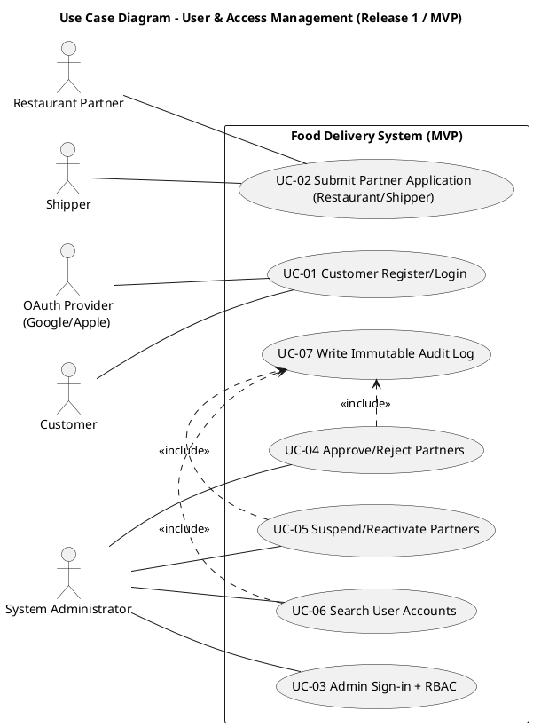
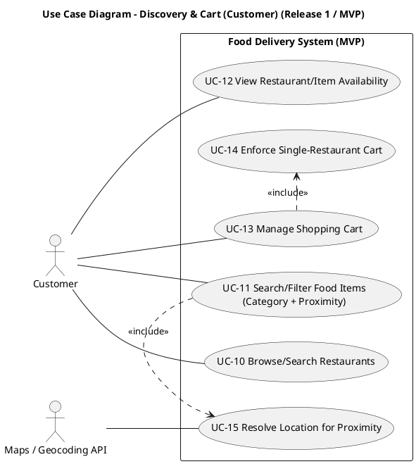
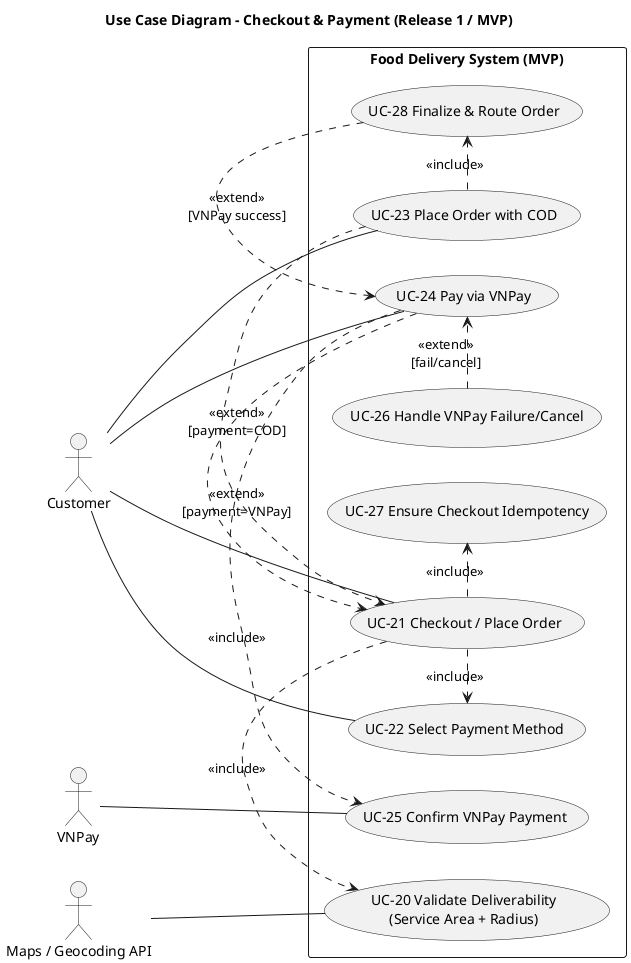
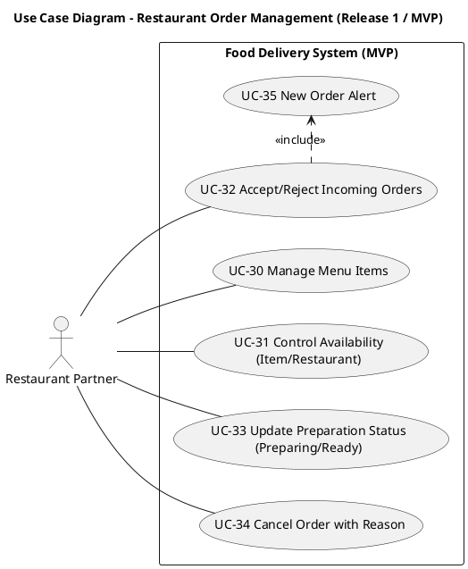
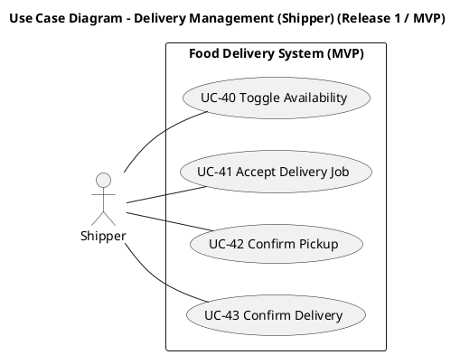
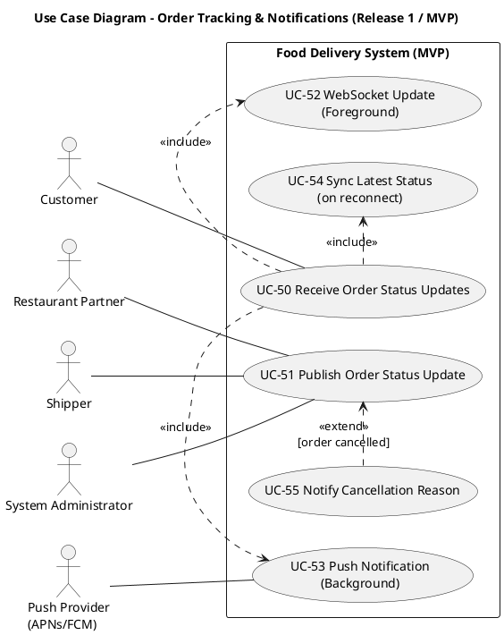
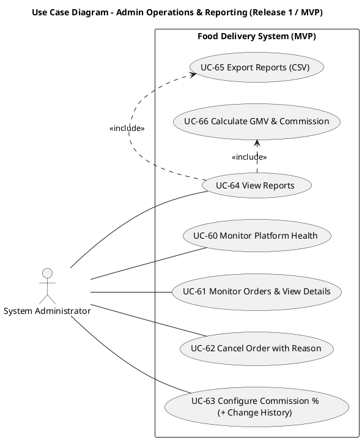

# Mô hình Use Case — Hệ thống Giao Đồ Ăn (Release 1 / MVP)

Version 1.0  
Ngày: 24/03/2026  
Nhóm thực hiện: Development Team

## Bảng ghi nhận thay đổi tài liệu

| Ngày       | Phiên bản | Mô tả                                                                      | Tác giả          |
| ---------- | --------: | -------------------------------------------------------------------------- | ---------------- |
| 24/03/2026 |       1.0 | Use case theo miền nghiệp vụ: sơ đồ, actor, danh sách use case, đặc tả MVP | Development Team |

---

# 1. Sơ đồ Use-case

> Mỗi sơ đồ tương ứng một **miền nghiệp vụ** (business domain). PlantUML blocks bên dưới là runnable (`@startuml` → `@enduml`).

## 1.1 Use-case Quản lý người dùng & truy cập

Nguồn `.puml`: `Documents/usecase-diagrams/01-user-access.puml`

## 1.2 Use-case Khám phá & giỏ hàng (Customer)

Nguồn `.puml`: `Documents/usecase-diagrams/02-discovery-cart.puml`

## 1.3 Use-case Checkout & thanh toán

Nguồn `.puml`: `Documents/usecase-diagrams/03-checkout-payment.puml`

## 1.4 Use-case Quản lý đơn hàng phía Nhà hàng

Nguồn `.puml`: `Documents/usecase-diagrams/04-restaurant-orders.puml`

## 1.5 Use-case Quản lý giao hàng (Shipper)

Nguồn `.puml`: `Documents/usecase-diagrams/05-delivery-shipper.puml`

## 1.6 Use-case Theo dõi đơn & thông báo

Nguồn `.puml`: `Documents/usecase-diagrams/06-tracking-notifications.puml`

## 1.7 Use-case Vận hành Admin & báo cáo

Nguồn `.puml`: `Documents/usecase-diagrams/07-admin-ops-reporting.puml`

---

# 2. Danh sách các Actor

| STT | Tên Actor                     | Ý nghĩa/Ghi chú                                                                                                |
| --: | ----------------------------- | -------------------------------------------------------------------------------------------------------------- |
|   1 | Customer                      | Người đặt món: khám phá nhà hàng/món, quản lý giỏ, checkout, theo dõi đơn.                                     |
|   2 | Restaurant Partner            | Nhà hàng/nhân viên bếp: quản lý menu & availability, nhận và xử lý đơn.                                        |
|   3 | Shipper                       | Nhân viên giao hàng: bật/tắt sẵn sàng, nhận job, pickup, delivered.                                            |
|   4 | System Administrator          | Vận hành hệ thống: duyệt đối tác, giám sát, can thiệp hủy đơn, cấu hình commission, báo cáo.                   |
|   5 | VNPay                         | Cổng thanh toán online; hệ thống chỉ finalize/routing sau khi nhận xác nhận thành công (BR-4).                 |
|   6 | OAuth Provider (Google/Apple) | Xác thực đăng nhập OAuth cho luồng đăng ký/đăng nhập (SRS FR-1.1).                                             |
|   7 | Maps/Geocoding API            | Geocoding và tính toán khoảng cách: proximity search + kiểm tra bán kính + service area (Vision dependencies). |
|   8 | Push Provider (APNs/FCM)      | Gửi push notification khi ứng dụng nền/đóng (SRS FR-2.3).                                                      |

---

# 3. Danh sách các Use-case

Danh sách dưới đây là **7 Use Case theo miền nghiệp vụ** (mỗi Use Case tương ứng 1 sơ đồ ở Mục 1). Mỗi Use Case miền sẽ được **phân rã** thành các Use Case con (UC-xx) đã thể hiện trong PlantUML.

| STT | Use Case ID (Miền) | Tên Use Case (Miền nghiệp vụ)           | Actor chính                                                                 | Nguồn sơ đồ                                                 | Bao gồm (Use Case con)       |
| --: | ------------------ | --------------------------------------- | --------------------------------------------------------------------------- | ----------------------------------------------------------- | ---------------------------- |
|   1 | UC-D1              | Use-case Quản lý người dùng & truy cập  | Customer; Restaurant Partner; Shipper; System Administrator; OAuth Provider | `Documents/usecase-diagrams/01-user-access.puml`            | UC-01..UC-07                 |
|   2 | UC-D2              | Use-case Khám phá & giỏ hàng (Customer) | Customer; Device Location Service (GPS); Maps/Geocoding API                 | `Documents/usecase-diagrams/02-discovery-cart.puml`         | UC-10..UC-20 (theo sơ đồ 02) |
|   3 | UC-D3              | Use-case Checkout & thanh toán          | Customer; VNPay; Maps/Geocoding API                                         | `Documents/usecase-diagrams/03-checkout-payment.puml`       | UC-20..UC-28                 |
|   4 | UC-D4              | Use-case Quản lý đơn hàng phía Nhà hàng | Restaurant Partner                                                          | `Documents/usecase-diagrams/04-restaurant-orders.puml`      | UC-30..UC-35                 |
|   5 | UC-D5              | Use-case Quản lý giao hàng (Shipper)    | Shipper                                                                     | `Documents/usecase-diagrams/05-delivery-shipper.puml`       | UC-40..UC-43                 |
|   6 | UC-D6              | Use-case Theo dõi đơn & thông báo       | Customer; Restaurant Partner; Shipper; System Administrator; Push Provider  | `Documents/usecase-diagrams/06-tracking-notifications.puml` | UC-50..UC-55                 |
|   7 | UC-D7              | Use-case Vận hành Admin & báo cáo       | System Administrator                                                        | `Documents/usecase-diagrams/07-admin-ops-reporting.puml`    | UC-60..UC-66                 |

---

# 4. Đặc tả Use-case

Ghi chú chung (áp dụng cho nhiều Use Case miền):

- BR-2: Giỏ hàng chỉ chứa món của 1 nhà hàng.
- BR-3: Địa chỉ giao phải nằm trong bán kính phục vụ nhà hàng.
- BR-4: VNPay thành công mới được finalize/routing đơn.
- BR-6: MVP chỉ hoạt động trong một service area.
- BR-7: Trạng thái đơn phải đi theo chuỗi hợp lệ.
- FR-2.3/FR-2.4: Push notification và hiển thị lý do hủy.

Dưới đây là **đặc tả cho 7 Use Case miền** ở Mục 3 (theo format tham khảo).

## UC-D1 — Use-case Quản lý người dùng & truy cập

|                                               |                                                                                                                                                                                                                                                                                                                                        |
| --------------------------------------------- | -------------------------------------------------------------------------------------------------------------------------------------------------------------------------------------------------------------------------------------------------------------------------------------------------------------------------------------- |
| Use Case ID                                   | UC-D1                                                                                                                                                                                                                                                                                                                                  |
| Tên Use Case                                  | Use-case Quản lý người dùng & truy cập                                                                                                                                                                                                                                                                                                 |
| Actor                                         | Customer; Restaurant Partner; Shipper; System Administrator; OAuth Provider (Google/Apple)                                                                                                                                                                                                                                             |
| Mô tả (Description)                           | Quản lý đăng ký/đăng nhập, nộp hồ sơ đối tác, đăng nhập admin + RBAC, duyệt/tạm khóa, tra cứu tài khoản và ghi audit log cho hành động quản trị (FR-1.1; FR-4.1..FR-4.3; FR-4.16; BR-1).                                                                                                                                               |
| Điều kiện tiên quyết (Preconditions)          | (1) Hệ thống hoạt động; (2) Có kết nối mạng; (3) OAuth provider sẵn sàng (nếu dùng OAuth).                                                                                                                                                                                                                                             |
| Kết quả sau cùng (Postconditions)             | (1) Session người dùng được tạo hoặc bị từ chối an toàn; (2) Hồ sơ partner ở trạng thái `Pending Approval`/`Approved`/`Rejected`; (3) Admin action được enforce RBAC và có audit log.                                                                                                                                                  |
| Mức độ ưu tiên (Priority)                     | Cao                                                                                                                                                                                                                                                                                                                                    |
| Tần suất sử dụng (Frequency of Use)           | Hàng ngày                                                                                                                                                                                                                                                                                                                              |
| Luồng sự kiện chính (Normal Course of Events) | 1) Người dùng đăng ký/đăng nhập (email hoặc OAuth). 2) Partner nộp hồ sơ đăng ký hoạt động trên nền tảng. 3) Admin đăng nhập dashboard, hệ thống nạp quyền và enforce RBAC. 4) Admin duyệt/từ chối hồ sơ hoặc tạm khóa/mở lại account theo quy định. 5) Hệ thống ghi audit log cho các hành động quản trị theo chính sách. |
| Luồng thay thế (Alternative Courses)          | A1) Đăng nhập OAuth thay cho email/password. A2) Admin thao tác nhưng thiếu quyền → bị từ chối và ghi nhận attempt (không lộ thông tin nhạy cảm).                                                                                                                                                                                   |
| Ngoại lệ (Exceptions)                         | E1) Dịch vụ auth/OAuth lỗi → hiển thị lỗi retryable; không crash; không tạo session sai. E2) Ghi audit log thất bại → xử lý theo policy thống nhất (block hoặc retry).                                                                                                                                                              |
| Bao gồm (Includes)                            | UC-01..UC-07 (theo sơ đồ 01).                                                                                                                                                                                                                                                                                                          |
| Mở rộng (Extends)                             | Không                                                                                                                                                                                                                                                                                                                                  |
| Yêu cầu đặc biệt (Special Requirements)       | Bảo mật (không log dữ liệu nhạy cảm); RBAC bắt buộc cho admin actions; audit log bất biến cho admin actions (FR-4.16).                                                                                                                                                                                                                 |
| Giả định (Assumptions)                        | OAuth provider tuân thủ SLA và hợp đồng tích hợp; Admin quy trình duyệt là thủ công (MVP).                                                                                                                                                                                                                                             |
| Ghi chú & Vấn đề (Notes and Issues)           | Có thể cho phép browse menu không cần login (tuỳ chính sách MVP); nếu vậy thì UC-D2 có thể độc lập UC-D1 ở mức UI.                                                                                                                                                                                                                     |

## UC-D2 — Use-case Khám phá & giỏ hàng (Customer)

|                                               |                                                                                                                                                                                                                                                                                                                                                                                                                                                                |
| --------------------------------------------- | -------------------------------------------------------------------------------------------------------------------------------------------------------------------------------------------------------------------------------------------------------------------------------------------------------------------------------------------------------------------------------------------------------------------------------------------------------------- |
| Use Case ID                                   | UC-D2                                                                                                                                                                                                                                                                                                                                                                                                                                                          |
| Tên Use Case                                  | Use-case Khám phá & giỏ hàng (Customer)                                                                                                                                                                                                                                                                                                                                                                                                                        |
| Actor                                         | Customer; Device Location Service (GPS); Maps/Geocoding API                                                                                                                                                                                                                                                                                                                                                                                                    |
| Mô tả (Description)                           | Customer khám phá nhà hàng/món theo tên/category/proximity, xem availability, quản lý giỏ hàng và enforce giỏ chỉ 1 nhà hàng (FR-1.2; FR-1.3; BR-2; BR-8; US-2/3/4/5/22).                                                                                                                                                                                                                                                                                      |
| Điều kiện tiên quyết (Preconditions)          | Có dữ liệu nhà hàng/menu active; có location (GPS permission hoặc địa chỉ nhập tay) khi dùng proximity.                                                                                                                                                                                                                                                                                                                                                        |
| Kết quả sau cùng (Postconditions)             | Customer nhìn thấy danh sách nhà hàng/món phù hợp; giỏ hàng cập nhật đúng; không thể chứa món từ nhiều nhà hàng; món sold-out/nhà hàng closed bị chặn add-to-cart.                                                                                                                                                                                                                                                                                             |
| Mức độ ưu tiên (Priority)                     | Cao                                                                                                                                                                                                                                                                                                                                                                                                                                                            |
| Tần suất sử dụng (Frequency of Use)           | Hàng ngày                                                                                                                                                                                                                                                                                                                                                                                                                                                      |
| Luồng sự kiện chính (Normal Course of Events) | 1) Customer browse/search nhà hàng và/hoặc tìm món theo category + proximity. 2) Khi cần proximity, Customer cung cấp vị trí (GPS hoặc nhập địa chỉ) và hệ thống geocode/reverse-geocode. 3) Customer mở chi tiết nhà hàng/menu và xem availability (closed/sold out). 4) Customer thêm/xóa/sửa số lượng món trong giỏ; hệ thống tính tổng. 5) Khi Customer cố thêm món khác nhà hàng, hệ thống chặn và đưa lựa chọn clear cart hoặc hủy thao tác. |
| Luồng thay thế (Alternative Courses)          | A1) Không có GPS permission → yêu cầu nhập địa chỉ; không trả kết quả proximity sai lệch. A2) Customer chọn “Clear Cart” để chuyển sang nhà hàng khác.                                                                                                                                                                                                                                                                                                      |
| Ngoại lệ (Exceptions)                         | E1) Maps/Geocoding API lỗi/quá quota → báo lỗi retry; không cho hiển thị “proximity giả”. E2) Availability thay đổi trong lúc browse → UI cần refresh trong cửa sổ mục tiêu.                                                                                                                                                                                                                                                                                |
| Bao gồm (Includes)                            | Các UC con trong sơ đồ 02 (UC-10..UC-20 tuỳ phiên bản sơ đồ 02).                                                                                                                                                                                                                                                                                                                                                                                               |
| Mở rộng (Extends)                             | Không                                                                                                                                                                                                                                                                                                                                                                                                                                                          |
| Yêu cầu đặc biệt (Special Requirements)       | Enforce BR-2 bắt buộc; enforce BR-8 (không add-to-cart item sold-out/restaurant closed).                                                                                                                                                                                                                                                                                                                                                                       |
| Giả định (Assumptions)                        | Customer có internet ổn định; dữ liệu menu/availability được partner cập nhật kịp thời (BR-8).                                                                                                                                                                                                                                                                                                                                                                 |
| Ghi chú & Vấn đề (Notes and Issues)           | Logic “deliverability” chi tiết được kiểm tra chặt ở UC-D3 (checkout). Ở UC-D2 có thể dùng proximity filter để giảm thất bại khi checkout (tuỳ cách thiết kế UX).                                                                                                                                                                                                                                                                                              |

## UC-D3 — Use-case Checkout & thanh toán

|                                               |                                                                                                                                                                                                                                                                                                                                                                                        |
| --------------------------------------------- | -------------------------------------------------------------------------------------------------------------------------------------------------------------------------------------------------------------------------------------------------------------------------------------------------------------------------------------------------------------------------------------- |
| Use Case ID                                   | UC-D3                                                                                                                                                                                                                                                                                                                                                                                  |
| Tên Use Case                                  | Use-case Checkout & thanh toán                                                                                                                                                                                                                                                                                                                                                         |
| Actor                                         | Customer; VNPay; Maps/Geocoding API                                                                                                                                                                                                                                                                                                                                                    |
| Mô tả (Description)                           | Customer checkout và đặt đơn theo COD hoặc VNPay; hệ thống enforce deliverability (service area + radius), chọn payment, idempotency, và chỉ finalize/routing khi VNPay confirm success (FR-1.4; FR-1.5; BR-3/4/6; US-6/7).                                                                                                                                                            |
| Điều kiện tiên quyết (Preconditions)          | Giỏ hợp lệ (1 nhà hàng); Customer có địa chỉ giao; hệ thống tích hợp VNPay sẵn sàng khi chọn VNPay.                                                                                                                                                                                                                                                                                    |
| Kết quả sau cùng (Postconditions)             | COD: đơn được finalize/routing ngay. VNPay: chỉ finalize/routing sau khi nhận confirm success; fail/cancel → không routing và hiển thị trạng thái rõ ràng.                                                                                                                                                                                                                          |
| Mức độ ưu tiên (Priority)                     | Cao                                                                                                                                                                                                                                                                                                                                                                                    |
| Tần suất sử dụng (Frequency of Use)           | Hàng ngày                                                                                                                                                                                                                                                                                                                                                                              |
| Luồng sự kiện chính (Normal Course of Events) | 1) Customer mở checkout và xác nhận địa chỉ giao. 2) Hệ thống validate deliverability (service area + bán kính). 3) Customer chọn COD hoặc VNPay. 4) Hệ thống enforce idempotency chống tạo đơn trùng khi retry. 5) Nếu COD: tạo đơn và finalize/routing. 6) Nếu VNPay: khởi tạo phiên thanh toán, nhận callback/return, xác thực, và chỉ finalize/routing khi success. |
| Luồng thay thế (Alternative Courses)          | A1) VNPay fail/cancel → hiển thị thất bại/hủy, cho retry; không routing. A2) Retry checkout với cùng idempotency key trong TTL → trả về cùng order ID.                                                                                                                                                                                                                              |
| Ngoại lệ (Exceptions)                         | E1) Deliverability fail → chặn checkout và hiển thị lý do (ngoài service area / ngoài bán kính). E2) Callback VNPay không hợp lệ → coi như fail; không finalize/routing.                                                                                                                                                                                                            |
| Bao gồm (Includes)                            | UC-20..UC-28 (theo sơ đồ 03).                                                                                                                                                                                                                                                                                                                                                          |
| Mở rộng (Extends)                             | Không                                                                                                                                                                                                                                                                                                                                                                                  |
| Yêu cầu đặc biệt (Special Requirements)       | BR-4 là ràng buộc cứng: VNPay chưa confirm success thì không finalize/routing; idempotency bắt buộc cho luồng checkout.                                                                                                                                                                                                                                                                |
| Giả định (Assumptions)                        | VNPay sandbox/production hoạt động theo hợp đồng và có cơ chế verify chữ ký.                                                                                                                                                                                                                                                                                                           |
| Ghi chú & Vấn đề (Notes and Issues)           | Cần quy định rõ trạng thái đơn khi VNPay fail/cancel (payment_failed/cancelled) để đảm bảo thống kê/hiển thị nhất quán.                                                                                                                                                                                                                                                                |

## UC-D4 — Use-case Quản lý đơn hàng phía Nhà hàng

|                                               |                                                                                                                                                                                                                                                                                                                                                                                                                 |
| --------------------------------------------- | --------------------------------------------------------------------------------------------------------------------------------------------------------------------------------------------------------------------------------------------------------------------------------------------------------------------------------------------------------------------------------------------------------------- |
| Use Case ID                                   | UC-D4                                                                                                                                                                                                                                                                                                                                                                                                           |
| Tên Use Case                                  | Use-case Quản lý đơn hàng phía Nhà hàng                                                                                                                                                                                                                                                                                                                                                                         |
| Actor                                         | Restaurant Partner                                                                                                                                                                                                                                                                                                                                                                                              |
| Mô tả (Description)                           | Nhà hàng quản lý menu & availability, nhận đơn mới, accept/reject theo timeout, cập nhật trạng thái chuẩn bị và hủy đơn với lý do (FR-3.1..FR-3.4; BR-7/8; US-11/12/13/23/24).                                                                                                                                                                                                                                  |
| Điều kiện tiên quyết (Preconditions)          | Partner đã được admin duyệt; đã đăng nhập portal; đơn đã được route tới nhà hàng.                                                                                                                                                                                                                                                                                                                               |
| Kết quả sau cùng (Postconditions)             | Menu/availability cập nhật và phản ánh cho customer; đơn được accept/reject/hủy đúng rule; trạng thái đơn tiến triển đúng chuỗi (BR-7).                                                                                                                                                                                                                                                                         |
| Mức độ ưu tiên (Priority)                     | Cao                                                                                                                                                                                                                                                                                                                                                                                                             |
| Tần suất sử dụng (Frequency of Use)           | Hàng ngày                                                                                                                                                                                                                                                                                                                                                                                                       |
| Luồng sự kiện chính (Normal Course of Events) | 1) Partner cập nhật menu và trạng thái sold-out/closed khi cần. 2) Khi có đơn mới, hệ thống phát alert nổi bật và hiển thị chi tiết đơn. 3) Partner accept hoặc reject đơn trong thời gian cho phép; hệ thống cập nhật trạng thái và notify các bên. 4) Partner cập nhật Preparing/Ready for Pickup theo chuỗi hợp lệ. 5) Nếu cần hủy trước pickup, partner nhập lý do và hệ thống notify customer. |
| Luồng thay thế (Alternative Courses)          | A1) Quá hạn accept timeout → hệ thống đánh dấu expired/unaccepted và notify customer.                                                                                                                                                                                                                                                                                                                           |
| Ngoại lệ (Exceptions)                         | E1) Thao tác chuyển trạng thái sai chuỗi (BR-7) → bị từ chối. E2) Lỗi kết nối/lưu trạng thái → retry, không tạo trạng thái “nửa chừng”.                                                                                                                                                                                                                                                                      |
| Bao gồm (Includes)                            | UC-30..UC-35 (theo sơ đồ 04).                                                                                                                                                                                                                                                                                                                                                                                   |
| Mở rộng (Extends)                             | Không                                                                                                                                                                                                                                                                                                                                                                                                           |
| Yêu cầu đặc biệt (Special Requirements)       | Alert đơn mới phải nổi bật, dễ nhận biết trong bếp (FR-3.3); availability phải có hiệu lực nhanh để chặn đơn mới (BR-8).                                                                                                                                                                                                                                                                                        |
| Giả định (Assumptions)                        | Thiết bị bếp có kết nối ổn định; staff thao tác tối thiểu.                                                                                                                                                                                                                                                                                                                                                      |
| Ghi chú & Vấn đề (Notes and Issues)           | Thống nhất reason codes cho reject/timeout/cancel để tracking & hỗ trợ vận hành dễ hơn.                                                                                                                                                                                                                                                                                                                         |

## UC-D5 — Use-case Quản lý giao hàng (Shipper)

|                                               |                                                                                                                                                                                                                                                                                                                            |
| --------------------------------------------- | -------------------------------------------------------------------------------------------------------------------------------------------------------------------------------------------------------------------------------------------------------------------------------------------------------------------------- |
| Use Case ID                                   | UC-D5                                                                                                                                                                                                                                                                                                                      |
| Tên Use Case                                  | Use-case Quản lý giao hàng (Shipper)                                                                                                                                                                                                                                                                                       |
| Actor                                         | Shipper                                                                                                                                                                                                                                                                                                                    |
| Mô tả (Description)                           | Shipper bật/tắt sẵn sàng, nhận job, xác nhận pickup và delivered; hệ thống enforce chỉ shipper được assign mới cập nhật trạng thái; cập nhật tuân BR-7 (US-15/16/17; BR-7).                                                                                                                                                |
| Điều kiện tiên quyết (Preconditions)          | Shipper đã được admin duyệt; đã đăng nhập; có job được dispatch.                                                                                                                                                                                                                                                           |
| Kết quả sau cùng (Postconditions)             | Trạng thái shipper availability đồng bộ; job được assign duy nhất; trạng thái đơn chuyển đúng (Picked Up/Delivered) và publish cho customer/admin.                                                                                                                                                                         |
| Mức độ ưu tiên (Priority)                     | Cao                                                                                                                                                                                                                                                                                                                        |
| Tần suất sử dụng (Frequency of Use)           | Hàng ngày                                                                                                                                                                                                                                                                                                                  |
| Luồng sự kiện chính (Normal Course of Events) | 1) Shipper set Available để nhận job. 2) Shipper nhận dispatch request và accept job; hệ thống lock assignment chống double-assign. 3) Shipper đến nhà hàng và confirm pickup; hệ thống validate trạng thái hợp lệ. 4) Shipper giao đến khách và confirm delivered; hệ thống ghi timestamp/actor để traceability. |
| Luồng thay thế (Alternative Courses)          | A1) Mạng chập chờn → app hiển thị trạng thái queued/retry; server không đổi trạng thái nếu chưa ghi nhận thành công.                                                                                                                                                                                                       |
| Ngoại lệ (Exceptions)                         | E1) Out-of-sequence (BR-7) → từ chối transition. E2) Shipper không phải người được assign → bị từ chối (security).                                                                                                                                                                                                      |
| Bao gồm (Includes)                            | UC-40..UC-43 (theo sơ đồ 05).                                                                                                                                                                                                                                                                                              |
| Mở rộng (Extends)                             | Không                                                                                                                                                                                                                                                                                                                      |
| Yêu cầu đặc biệt (Special Requirements)       | Bảo mật: chỉ shipper assigned cập nhật pickup/delivered; độ tin cậy cao tránh double-assign.                                                                                                                                                                                                                               |
| Giả định (Assumptions)                        | Shipper sử dụng smartphone + GPS; có kết nối mobile data.                                                                                                                                                                                                                                                                  |
| Ghi chú & Vấn đề (Notes and Issues)           | Có thể cần tách “dispatch/assignment” thành module riêng nếu mở rộng thuật toán phân công.                                                                                                                                                                                                                                 |

## UC-D6 — Use-case Theo dõi đơn & thông báo

|                                               |                                                                                                                                                                                                                                                                                |
| --------------------------------------------- | ------------------------------------------------------------------------------------------------------------------------------------------------------------------------------------------------------------------------------------------------------------------------------ |
| Use Case ID                                   | UC-D6                                                                                                                                                                                                                                                                          |
| Tên Use Case                                  | Use-case Theo dõi đơn & thông báo                                                                                                                                                                                                                                              |
| Actor                                         | Customer; Restaurant Partner; Shipper; System Administrator; Push Provider (APNs/FCM)                                                                                                                                                                                          |
| Mô tả (Description)                           | Hệ thống publish/receive cập nhật trạng thái đơn theo thời gian gần thực; khi app foreground dùng WebSocket, khi background/closed dùng push; khi hủy phải kèm lý do (FR-2.1..FR-2.4; US-9).                                                                                   |
| Điều kiện tiên quyết (Preconditions)          | Order tồn tại; các bên thực hiện hành động làm thay đổi trạng thái; push provider/WebSocket sẵn sàng.                                                                                                                                                                          |
| Kết quả sau cùng (Postconditions)             | Customer nhận cập nhật trạng thái đúng & kịp thời; nếu hủy có reason; khi reconnect có thể sync latest state.                                                                                                                                                                  |
| Mức độ ưu tiên (Priority)                     | Cao                                                                                                                                                                                                                                                                            |
| Tần suất sử dụng (Frequency of Use)           | Hàng ngày                                                                                                                                                                                                                                                                      |
| Luồng sự kiện chính (Normal Course of Events) | 1) Restaurant/Shipper/Admin thay đổi trạng thái đơn hợp lệ. 2) Hệ thống publish update sự kiện trạng thái. 3) Nếu app foreground: đẩy WebSocket cập nhật UI. 4) Nếu app background/closed: gửi push notification. 5) Nếu đơn bị hủy: notify kèm lý do theo FR-2.4. |
| Luồng thay thế (Alternative Courses)          | A1) App reconnect sau mất mạng → sync trạng thái mới nhất để tránh lệch UI.                                                                                                                                                                                                    |
| Ngoại lệ (Exceptions)                         | E1) Push/WebSocket bị degraded → cần cơ chế fallback theo thiết kế (ví dụ polling) để không “mất update”.                                                                                                                                                                      |
| Bao gồm (Includes)                            | UC-50..UC-55 (theo sơ đồ 06).                                                                                                                                                                                                                                                  |
| Mở rộng (Extends)                             | Không                                                                                                                                                                                                                                                                          |
| Yêu cầu đặc biệt (Special Requirements)       | Độ trễ cập nhật mục tiêu phải đáp ứng UX; khi hủy luôn có reason; không lộ thông tin nhạy cảm qua push payload.                                                                                                                                                                |
| Giả định (Assumptions)                        | APNs/FCM và WebSocket infra đáp ứng mức sẵn sàng theo kế hoạch MVP.                                                                                                                                                                                                            |
| Ghi chú & Vấn đề (Notes and Issues)           | Nếu MVP chưa có live map tracking, vẫn cần đảm bảo trạng thái “Picked Up/Delivered” cập nhật đúng và nhanh.                                                                                                                                                                    |

## UC-D7 — Use-case Vận hành Admin & báo cáo

|                                               |                                                                                                                                                                                                                                                                                                        |
| --------------------------------------------- | ------------------------------------------------------------------------------------------------------------------------------------------------------------------------------------------------------------------------------------------------------------------------------------------------------ |
| Use Case ID                                   | UC-D7                                                                                                                                                                                                                                                                                                  |
| Tên Use Case                                  | Use-case Vận hành Admin & báo cáo                                                                                                                                                                                                                                                                      |
| Actor                                         | System Administrator                                                                                                                                                                                                                                                                                   |
| Mô tả (Description)                           | Admin giám sát nền tảng và đơn hàng, can thiệp hủy đơn với lý do, cấu hình commission và truy cập báo cáo/xuất CSV; các hành động nhạy cảm cần audit log (FR-4.10..FR-4.16; BR-5).                                                                                                                     |
| Điều kiện tiên quyết (Preconditions)          | Admin đã đăng nhập và có quyền phù hợp (RBAC).                                                                                                                                                                                                                                                         |
| Kết quả sau cùng (Postconditions)             | Admin xem được trạng thái hệ thống/đơn; can thiệp hợp lệ có ghi nhận; báo cáo/xuất CSV phục vụ đối soát; cấu hình commission có lịch sử.                                                                                                                                                               |
| Mức độ ưu tiên (Priority)                     | Cao                                                                                                                                                                                                                                                                                                    |
| Tần suất sử dụng (Frequency of Use)           | Hàng ngày                                                                                                                                                                                                                                                                                              |
| Luồng sự kiện chính (Normal Course of Events) | 1) Admin mở dashboard và xem tổng quan health/orders. 2) Admin lọc/tìm và mở chi tiết đơn để điều tra. 3) Khi cần, admin hủy đơn và nhập lý do; hệ thống notify các bên và ghi audit. 4) Admin cấu hình commission % và hệ thống lưu lịch sử thay đổi. 5) Admin xem báo cáo và export CSV. |
| Luồng thay thế (Alternative Courses)          | A1) Một số báo cáo/metric có thể được precompute theo lịch (scheduler) để tăng hiệu năng (tuỳ thiết kế).                                                                                                                                                                                               |
| Ngoại lệ (Exceptions)                         | E1) Admin không đủ quyền → bị từ chối (RBAC). E2) Export lỗi → retry; bảo toàn tính đúng đắn dữ liệu xuất.                                                                                                                                                                                          |
| Bao gồm (Includes)                            | UC-60..UC-66 (theo sơ đồ 07).                                                                                                                                                                                                                                                                          |
| Mở rộng (Extends)                             | Không                                                                                                                                                                                                                                                                                                  |
| Yêu cầu đặc biệt (Special Requirements)       | Audit log bất biến cho admin actions (FR-4.16); báo cáo phải có định dạng ổn định cho đối soát (CSV).                                                                                                                                                                                                  |
| Giả định (Assumptions)                        | Dữ liệu đơn hàng và commission snapshot đủ để tính GMV/commission đúng (BR-5).                                                                                                                                                                                                                         |
| Ghi chú & Vấn đề (Notes and Issues)           | Cần thống nhất mô hình tính report (on-demand vs precomputed) để phản ánh đúng trong sơ đồ 07 và thiết kế backend.                                                                                                                                                                                     |
